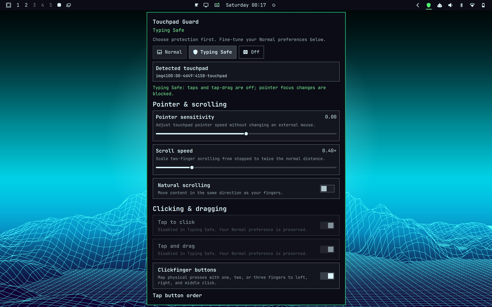

# Touchpad Guard

Stop accidental touchpad taps while you type—without giving up two-finger scrolling.

Touchpad Guard is a persistent, mode-first bar widget for the Quickshell-based Omarchy shell. One click or shortcut moves between everyday touchpad behavior, a safer typing mode, and fully Off. The same panel also keeps Hyprland's useful touchpad settings in one place.



## Three clear modes

| Mode | Tap and tap-drag | Scroll and pointer movement | Physical clickpad press | Pointer-driven focus |
|---|---|---|---|---|
| **Normal** | Your saved preference | Available | Available | Your saved Hyprland behavior |
| **Typing Safe** | Forced off | Available | Available | Protected by default |
| **Off** | Off | Off | Off | Unchanged |

Typing Safe is deliberately explicit. It does not guess when you are typing, and it does not install a low-level input filter.

## Install

Requires the Quickshell-based Omarchy shell and Hyprland 0.56 or newer.

```bash
omarchy plugin add https://github.com/Kyotroo/omarchy-touchpad-guard.git
omarchy plugin enable kdm.touchpad-guard
```

The widget is added to the right side of the Omarchy bar. Move it with Omarchy's bar settings if you prefer another position.

### Add the shortcut

Add this to `~/.config/hypr/bindings.lua`:

```lua
o.bind("SUPER + SHIFT + T", "Cycle touchpad guard", "omarchy-shell kdm.touchpad-guard cycle")
```

Then reload Hyprland:

```bash
hyprctl reload
```

If that key is already bound to `omarchy toggle touchpad`, replace that one binding instead of adding a duplicate.

## Use

- **Left-click** the bar icon to cycle Normal → Typing Safe → Off → Normal.
- **Right-click** to open the mode and settings panel.
- **Middle-click** to refresh detected hardware and state.
- Press **Super + Shift + T** to cycle without using the touchpad.

The icon and tooltip always identify Normal, Typing Safe, Off, unavailable hardware, or an error. Successful mode changes also produce an Omarchy OSD.

Keyboard users can navigate the panel with `j`/`k` or the arrow keys, adjust sliders and option rows with `h`/`l`, activate with Enter or Space, and close with Escape.

## Advanced settings

Touchpad Guard reads the current Hyprland values the first time it runs, then saves the Normal profile independently:

- Pointer sensitivity
- Two-finger scroll speed
- Natural scrolling
- Tap-to-click
- Tap-and-drag
- Clickfinger behavior
- Tap button order
- Middle-button emulation
- Drag lock
- Three- or four-finger drag
- Hyprland's native Disable while typing
- Keyboard-focus protection in Typing Safe

Changes apply immediately. Typing Safe visibly locks tap-to-click and tap-and-drag off but leaves the saved Normal choices untouched. Off keeps every preference ready for restoration.

### Keyboard-focus protection

Hyprland's `follow_mouse` setting is global. When **Protect keyboard focus in Typing Safe** is enabled, Touchpad Guard temporarily sets it to zero so incidental pointer motion cannot move keyboard focus. That also changes focus-following behavior for an external mouse while Safe is active. Normal restores the value imported for the Normal profile.

### Disable while typing

The panel exposes Hyprland's native `disable_while_typing` option, but some input stacks still allow simultaneous typing and touchpad use. Touchpad Guard does not claim that native option will work on every machine. Typing Safe is the reliable manual protection this plugin provides.

## Sessions and state

Preferences are stored under:

```text
~/.local/state/omarchy/kdm-touchpad-guard/
```

Touchpad Guard never edits `~/.config/hypr/input.lua` or files under `/usr/share/omarchy`.

Every new Hyprland login starts in Normal. Restarting only the Omarchy shell during the same login retains the selected mode. A Hyprland configuration reload silently reapplies that mode, and device changes are reconciled automatically.

Touchpads and trackpads are detected from Hyprland's pointer list by their device names, following Omarchy's existing hardware-detection convention. Multiple matching devices receive the same mode and preferences.

**Reset to current Omarchy config** reloads Hyprland, imports the resulting touchpad values, replaces the saved Normal profile, and returns to Normal.

## Command interface

The bar widget exposes a small IPC interface:

```bash
omarchy-shell kdm.touchpad-guard status
omarchy-shell kdm.touchpad-guard cycle
omarchy-shell kdm.touchpad-guard normal
omarchy-shell kdm.touchpad-guard safe
omarchy-shell kdm.touchpad-guard off
omarchy-shell kdm.touchpad-guard set scrollFactor 0.6
omarchy-shell kdm.touchpad-guard reset
```

The controller can also be called directly from the installed plugin directory. Its machine-readable commands return a versioned JSON object.

## Recovery and troubleshooting

If the touchpad is Off and the widget or shell is unavailable, re-enable it from the keyboard:

```bash
omarchy toggle touchpad on
```

Refresh plugin discovery and inspect cached state:

```bash
omarchy-shell shell rescanPlugins
omarchy-shell kdm.touchpad-guard status | jq
```

During local plugin development, a full `omarchy restart shell` may be required after changing QML methods because the running component cache can retain the earlier interface.

If no touchpad appears, compare the hardware Omarchy detects with Hyprland's pointer list:

```bash
omarchy-hw-touchpad
hyprctl -j devices | jq '.mice'
```

## Remove

Switch to Normal before removal so saved preferences are restored and Omarchy's disabled-touchpad marker is cleared:

```bash
omarchy-shell kdm.touchpad-guard normal
omarchy plugin remove kdm.touchpad-guard
```

If the plugin has already been removed while Off, use `omarchy toggle touchpad on`.

Omarchy intentionally does not run plugin install or removal hooks, so Touchpad Guard does not modify bindings automatically. Remove its `SUPER + SHIFT + T` line manually if you no longer want the shortcut.

## Security and privacy

- No sudo, telemetry, network calls, install hooks, or runtime downloads.
- QML starts the bundled controller with an argument array, never a shell command string.
- Commands, settings, enums, numeric ranges, and device names are validated.
- State writes are size-bounded, ownership-checked, and atomically replaced.
- Invalid or unsafe state is quarantined and rebuilt from live Hyprland values.
- Device names are treated as data and escaped before reaching Hyprland's Lua evaluator.

## Development

Run the deterministic controller, model, package, concurrency, and failure-path suites:

```bash
bash tests/run
```

The tests use isolated command fixtures and never mutate the real touchpad.

## License

MIT

